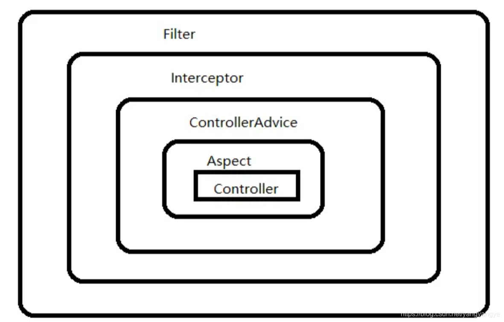
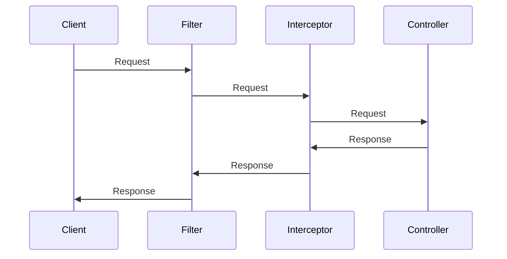

# Springboot Fileter VS Interceptor VS Aspect

這兩天專案上遇到要在很多地方處理 JWT，我提出 Filter 跟 Interceptor 都可以使用建議。

查一查發現，對吼，我還有 Aspect 也可以達到一樣的目的。

那到底，這三種到底有甚麼差別?

## 建立專案

來建立一個專案，後面把三個主題都動手寫寫看。

### 環境
 
- Project: maven
- Java 17
- spring boot 3.3.2
- Dependencies: 
  - Spring Web
  - Spring Boot DevTools
  - Lombok
  - org.springdoc 2.6.0

- 建立一個檔案 config/OpenApiConfig.java

```java
@Configuration
@OpenAPIDefinition(
        info = @Info(
                title = "Practice Filete, Interceptor, Aspect",
                version = "1.0"
        )
)
public class OpenApiConfig {
}
```

- 接下來就來實做吧

## 三者的介紹

### Filter

Filter 是 Servlet 的一部分，它可以在請求進入 Servlet 之前，以及響應返回之前，對請求進行處理。
也就是到達 Controller 及離開 Controller 之後，Filter 都可以進行處理。

Filter 的主要特點：

- 可以訪問 URL、headers、parameters 等
- 不知道哪個控制器方法會處理這個請求
- 可以修改請求和響應
- 可以阻止請求進入 Controller，但是是藉由不要進入 chain 來達到，不夠直觀。

例如：
```java
public void doFilter(ServletRequest request, ServletResponse response, FilterChain chain) {
    HttpServletRequest httpRequest = (HttpServletRequest) request;
    // 可以訪問 URL、headers、parameters 等
    String url = httpRequest.getRequestURL().toString();
    // 但不知道哪個控制器方法會處理這個請求
}
```

通常我們會用來執行一些通用的任務，例如日誌記錄、字符編碼轉換、驗證登錄用戶身份、數據篩選等。

#### 實作

接下來我們會用 Spring 提供的 `OncePerRequestFilter` 來實現 Filter。

當收到請求時，會經過 `doFilterInternal`，參數包含一個 `FilterChain`，他會將所有現有的`Filter`串起來，進入到 controller 時以升序執行，離開 controller 時以降序執行。

1. 先建立一個 `FilterTestController`
```java
@RestController
@RequestMapping("/filter")
public class FilterTestController {

    @GetMapping("/hello")
    @Operation(summary = "Hello")
    public String hello() {
        System.out.println("hello in FilterController");
        return "hello";
    }

}
```
2. 建立第一個 `FirstFilter`
```java
public class FirstFilter extends OncePerRequestFilter {
    @Override
    protected void doFilterInternal(HttpServletRequest request, HttpServletResponse response, FilterChain filterChain) throws ServletException, IOException {
        long startTime = System.currentTimeMillis();
        System.out.println("FirstFilter: Request URL before filterChain.doFilter: " + request.getRequestURL() + " Time: " + startTime + "ms");
        filterChain.doFilter(request, response);
        long endTime = System.currentTimeMillis();
        System.out.println("FirstFilter: Request URL after filterChain.doFilter: " + request.getRequestURL() + " Time: " + endTime + "ms");
    }
}
```
3. 建立第二個 `SecondFilter`
```java
public class SecondFilter extends OncePerRequestFilter {
    @Override
    protected void doFilterInternal(HttpServletRequest request, HttpServletResponse response, FilterChain filterChain) throws ServletException, IOException {
        long startTime = System.currentTimeMillis();
        System.out.println("SecondFilter: Request URL before filterChain.doFilter: " + request.getRequestURL() + " Time: " + startTime + "ms");
        filterChain.doFilter(request, response);
        long endTime = System.currentTimeMillis();
        System.out.println("SecondFilter: Request URL after filterChain.doFilter: " + request.getRequestURL() + " Time: " + endTime + "ms");
    }
}
```
4. 建立 `FilterConfig`
```java
@Configuration
public class FilterConfig {

  @Bean
  public FilterRegistrationBean FirstFilter() {
    FilterRegistrationBean<FirstFilter> bean = new FilterRegistrationBean<>();
    bean.setFilter(new FirstFilter());
    bean.addUrlPatterns("/filter/*"); // 設定 Filter 的 URL Pattern，只有符合這個 Pattern 的 URL 才會經過這個 Filter
    bean.setName("firstFilter"); // 設定 Filter 的名稱，要注意不要跟其他 Filter 重複
    bean.setOrder(1); // 設定 Filter 的執行順序
    return bean;
  }

  @Bean
  public FilterRegistrationBean SecondFilter() {
    FilterRegistrationBean<SecondFilter> bean = new FilterRegistrationBean<>();
    bean.setFilter(new SecondFilter());
    bean.addUrlPatterns("/filter/*"); // 設定 Filter 的 URL Pattern，只有符合這個 Pattern 的 URL 才會經過這個 Filter
    bean.setName("secondFilter"); // 設定 Filter 的名稱，要注意不要跟其他 Filter 重複
    bean.setOrder(2); // 設定 Filter 的執行順序
    return bean;
  }

}
```
5. 啟動專案，訪問 `http://localhost:8080/hello`，可以看到 console 有以下輸出
```
FirstFilter: Request URL before filterChain.doFilter: http://localhost:8080/hello Time: 1721801428816ms
SecondFilter: Request URL before filterChain.doFilter: http://localhost:8080/hello Time: 1721801428816ms
hello in FilterController
SecondFilter: Request URL after filterChain.doFilter: http://localhost:8080/hello Time: 1721801428818ms
FirstFilter: Request URL after filterChain.doFilter: http://localhost:8080/hello Time: 1721801428818ms
```

- 我們可以觀察到，`FirstFilter` 在 `SecondFilter` 之前執行，而在離開 Controller 時，`SecondFilter` 在 `FirstFilter` 之前執行。

### Interceptor

它可以在Controller處理請求之前、之後,以及完成視圖渲染之後執行特定的邏輯。

Interceptor的主要特點:

- 可以訪問請求和響應對象
- 可以決定請求是否繼續到達Controller，這個非常有用，可以用來實現權限控制。雖然 Filter 也可以藉由不要進入 chain 來達到，但 Interceptor 更可以藉由 return false 來達到。在程式碼的操作、閱讀與理解上會更為直觀。
- 可以在請求處理完成後執行一些後續操作
- 可以應用於特定的URL模式
- 可以知道將被使用的控制器方法資訊。

例如：
```java
public boolean preHandle(HttpServletRequest request, HttpServletResponse response, Object handler) {
    // 可以訪問 HTTP 請求資訊
    String url = request.getRequestURL().toString();
    
    if (handler instanceof HandlerMethod) {
        HandlerMethod handlerMethod = (HandlerMethod) handler;
        // 可以獲取將被調用的控制器方法資訊
        String controllerName = handlerMethod.getBeanType().getSimpleName();
        String methodName = handlerMethod.getMethod().getName();
        // 但不能直接獲取方法的實際參數值
    }
    return true;
}
```

接下來在回到我們的專案中來實作它吧。

#### 實作

1. 建立一個 `InterceptorTestController`
```java
@RestController
@RequestMapping("/interceptor")
public class InterceptorTestController {

  @GetMapping("/hello")
  public String hello() {
    System.out.println("hello in InterceptorController");
    return "hello";
  }

}
```
2. 建立一個 `CustomInterceptor`
```java
@Component
public class CustomInterceptor implements HandlerInterceptor {

  /*
  preHandle: 在Controller方法執行之前調用
   */
  @Override
  public boolean preHandle(HttpServletRequest request, HttpServletResponse response, Object handler)
          throws Exception {
    long startTime = System.currentTimeMillis();
    request.setAttribute("startTime", startTime);

    System.out.println("Request URL: " + request.getRequestURL().toString());
    System.out.println("Start Time: " + System.currentTimeMillis());

    return true; // 返回true表示繼續處理請求,返回false則請求將在此終止
  }

  /*
  postHandle: 在Controller方法執行之後調用
   */
  @Override
  public void postHandle(HttpServletRequest request, HttpServletResponse response, Object handler,
                         ModelAndView modelAndView) throws Exception {
    System.out.println("Request URL: " + request.getRequestURL().toString() +
            " Sent to Handler :: Current Time=" + System.currentTimeMillis());
  }

  /*
  afterCompletion: 在Controller方法執行之後,並且在生成視圖之後調用
   */
  @Override
  public void afterCompletion(HttpServletRequest request, HttpServletResponse response, Object handler,
                              Exception ex) throws Exception {
    long startTime = (Long) request.getAttribute("startTime");
    System.out.println("Request URL: " + request.getRequestURL().toString() +
            " :: End Time=" + System.currentTimeMillis());
    System.out.println("Time Taken=" + (System.currentTimeMillis() - startTime));
  }
}
```
3. 建立 `WebMvcConfig`
```java
@Configuration
@AllArgsConstructor
public class WebMvcConfig implements WebMvcConfigurer {

  private final CustomInterceptor customInterceptor;


  @Override
  public void addInterceptors(InterceptorRegistry registry) {
    registry.addInterceptor(customInterceptor)
            .addPathPatterns("/interceptor/*");  // 應用於所有URL
//                .excludePathPatterns("/admin/**"); // 排除admin路徑
  }
}
```
4. 啟動專案，訪問 `http://localhost:8080/interceptor/hello`，可以看到 console 有以下輸出
```
Request URL: http://localhost:8080/interceptor/hello
Start Time: 1721805129840
hello in InterceptorController
Request URL: http://localhost:8080/interceptor/hello Sent to Handler :: Current Time=1721805129843
Request URL: http://localhost:8080/interceptor/hello :: End Time=1721805129843
Time Taken=3
```

### Aspect

能拿到方法的參數資訊：Aspect 可以直接訪問被切入方法的參數。
拿不到 HTTP 請求資訊：Aspect 作用於方法級別，默認情況下不直接與 HTTP 層交互。

例如：
```java
@Around("execution(* com.example.controller.*.*(..))")
public Object logAround(ProceedingJoinPoint joinPoint) throws Throwable {
    // 可以訪問方法參數
    Object[] args = joinPoint.getArgs();
    String methodName = joinPoint.getSignature().getName();
    
    // 但不能直接訪問 HTTP 請求資訊
    // 如果需要，可以將 HttpServletRequest 作為參數傳遞給方法
    
    return joinPoint.proceed();
}
```

程式碼範例之前寫過了，我就不在這邊再寫一次了。
有興趣的話，可以來[這邊](https://github.com/mister33221/AOP-example.git)看看。

## 差別整理



| Filter                                        | Interceptor                                                      | 摘要                                         |
|-----------------------------------------------|------------------------------------------------------------------|--------------------------------------------|
| Filter 接口定義在 `javax.servlet` 包中               | 接口 `HandlerInterceptor` 定義在 `org.springframework.web.servlet` 包中 |                                            |
| Filter 在 `web.xml` 中定義                        |                                                                  |                                            |
| Filter 只在 Servlet 前後起作用。                      | 攔截器能夠深入到方法前後、異常拋出前後，具有更大的彈性。                                     | 在 Spring 框架中，優先使用攔截器。攔截器能輕鬆實現 Filter 的所有功能。 |
| Filter 是 Servlet 規範中定義的。                      | 攔截器既可用於 Web 程式，也可用於 Application、Swing 程式中。                       | 使用範圍不同                                     |
| Filter 是在 Servlet 規範中定義的，由 Servlet 容器支持。      | 攔截器是在 Spring 容器內，由 Spring 框架支持。                                  | 規範不同                                       |
| Filter 不能使用 Spring 容器資源                       | 攔截器是 Spring 組件，能使用 Spring 裡的任何資源，通過 IoC 注入。                      | 在 Spring 中使用攔截器更容易                         |
| Filter 由 Server（如 Tomcat）調用                   | Interceptor 由 Spring 調用                                          | 因此 Filter 總是優先於 Interceptor 執行             |

## 使用情境

| 機制 | 適合的使用情境 |
|------|----------------|
| OncePerRequestFilter | • 請求預處理（字符編碼設置、CORS處理）<br>• 安全相關（JWT Token驗證、基本身份驗證）<br>• 請求/響應修改（添加HTTP頭、壓縮響應內容）<br>• 全局異常處理<br>• 請求日誌記錄 |
| Interceptor | • 性能監控（記錄請求處理時間）<br>• 用戶會話管理<br>• 國際化（設置本地化資訊）<br>• 審計日誌（記錄用戶操作）<br>• 權限檢查（基於角色或權限的訪問控制）<br>• 數據預處理或後處理 |
| Aspect | • 事務管理<br>• 緩存處理<br>• 方法級安全<br>• 詳細的方法調用日誌記錄<br>• 統一的異常處理和日誌記錄<br>• 方法執行時間監控<br>• 參數驗證 |

選擇考慮因素：
1. 需要處理原始HTTP請求和響應時，選擇OncePerRequestFilter。
2. 需要在Spring MVC處理流程中進行干預時，選擇Interceptor。
3. 需要跨多個層實現通用功能或處理方法級別的邏輯時，選擇Aspect。

## 結論

我們用 mermaid 來畫一張一個 http request 進來後，經過 Filter、Interceptor 的流程圖。



總的來說，Filter、Interceptor、Aspect 都是 Spring 框架中用於處理請求的機制，各有各的特點和使用情境。

如果很單純只是要處理 HTTP request，Filter 就夠用了。

如果你需要對 HTTP request 做更多的操作及拒絕 request，Interceptor 就是你的選擇。

而 Aspect 則是功能強大、彈性也非常大，可以切在你想切得地方，不過也比較複雜，適合用來處理較為複雜的業務邏輯。
